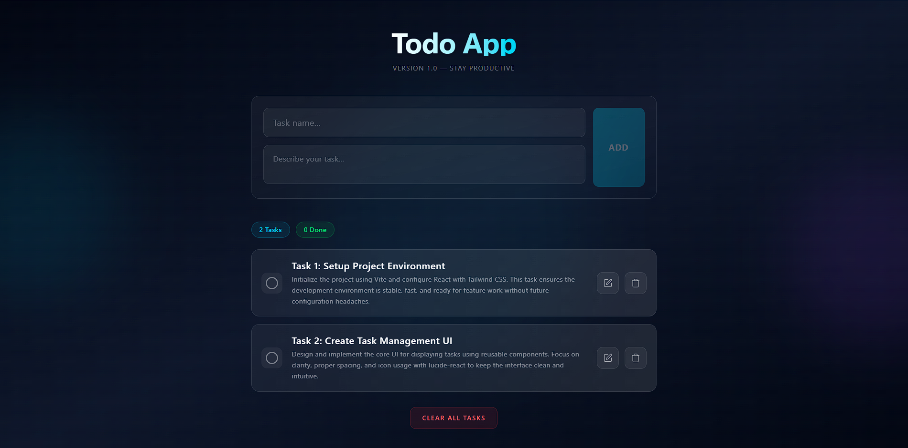

<div align="center">

# ✨ Todo App V1.0

A modern, sleek basic task management application built with React, JSON-server.


[Features](#-features) • [Tech Stack](#-tech-stack) • [Installation](#-installation) • [Usage](#-usage) • [Learning Outcomes](#-learning-outcomes)

</div>

---

## 📖 About The Project

Todo App V1.0 is a project for learning purpose only. It demonstrate how react works in very simple way.It is a beautifully designed task management application that combines functionality with aesthetics. It features a stunning dark theme with glassmorphism effects, glowing accents, and smooth animations that make task management a delightful experience.


## 📸 Screenshots



---

## ✨ Features

| Feature                | Description                                                     |
| ---------------------- | --------------------------------------------------------------- |
| **Create Tasks**       | Add new tasks with title and description                        |
| **Toggle Completion**  | Mark tasks as done/undone with visual feedback                  |
| **Delete Tasks**       | Remove individual tasks                                         |
| **Clear All**          | Delete all tasks at once                                        |
| **Persistent Storage** | Data persists via JSON Server (can not use in deployed version) |
| **Real-time Updates**  | Instant UI feedback on all actions                              |
| **Task Statistics**    | View total tasks and completed count                            |
| **Loading States**     | Beautiful loading indicators                                    |
| **Error Handling**     | Graceful error messages                                         |

---

## 🛠️ Tech Stack

- **React 19** - UI library with hooks (useState, useEffect).
- **Tailwind CSS 4** - Utility-first CSS framework.
- **Vite** - Next-generation frontend build tool.
- **Lucide React** - Beautiful icon library.
- **JSON-server** - for data storage.
- **React loading indicators** - for loading animation.

---

## 📁 Project Structure

```
todo-app-v1/
├── public/
├── src/
│   ├── components/
│   │   ├── AddTask.jsx
│   │   ├── TaskCard.jsx
│   │   └── TaskList.jsx
│   ├── App.jsx
│   ├── index.css
│   └── main.jsx
├── data.json
├── index.html
├── package.json
├── package-lock.json
└── vite.config.js
```
---

## 🚀 Installation

### Prerequisites

- Node.js (v18 or higher)
- npm

### Steps

1. **Clone the repository**

    ```bash
    git clone https://github.com/yourusername/todo-app.git
    cd todo-app
    ```

2. **Install dependencies**

    ```bash
    npm install
    npm install tailwindcss @tailwindcss/vite
    npm install lucide-react
    npm install react-loading-indicators
    npm install json-server
    ```

3. **Create the database file**

    Create a `data.json` file in the root directory:

    ```json
    {
        "tasks": []
    }
    ```

4. **Start JSON Server** (in a separate terminal)

    ```bash
    npx json-server --watch data.json --port 7000
    ```

5. **Start the development server**

    ```bash
    npm run dev
    ```

6. **Open your browser**

    Navigate to `http://localhost:5173`

---

## 📖 Usage

### Adding a Task

1. Enter a task name in the first input field
2. Add a description in the textarea
3. Click the **"Add"** button

### Completing a Task

- Click the circle icon on the left side of any task to toggle its completion status
- Completed tasks will show a checkmark and strikethrough text

### Deleting a Task

- Click the trash icon on the right side of any task to delete it

### Clearing All Tasks

- Click the **"Clear All Tasks"** button at the bottom to remove all tasks

---

## 🎓 Learning Outcomes

This project demonstrates proficiency in:

| Skill                     | Description                                                 |
| ------------------------- | ----------------------------------------------------------- |
| **React Fundamentals**    | Component architecture, props, and JSX                      |
| **React Hooks**           | useState for state management, useEffect for side effects   |
| **State Lifting**         | Passing state and callbacks between parent/child components |
| **REST API Integration**  | CRUD operations with fetch API                              |
| **Modern CSS**            | Tailwind CSS, glassmorphism, gradients, animations          |
| **Async JavaScript**      | Promises, async/await, error handling                       |
| **Component Design**      | Reusable, modular component patterns                        |

---

## 🔌 API Endpoints

| Method | Endpoint     | Description       |
| ------ | ------------ | ----------------- |
| GET    | `/tasks`     | Fetch all tasks   |
| POST   | `/tasks`     | Create a new task |
| DELETE | `/tasks/:id` | Delete a task     |

---

## 🙏 Acknowledgments

- [React](https://react.dev/) - The library for web and native user interfaces
- [Tailwind CSS](https://tailwindcss.com/) - A utility-first CSS framework
- [Lucide](https://lucide.dev/) - Beautiful & consistent icons
- [JSON Server](https://github.com/typicode/json-server) - Full fake REST API

---

<div align="center">

**⭐ Star this repo if you found it helpful!**

Made with ❤️ and React

</div>
